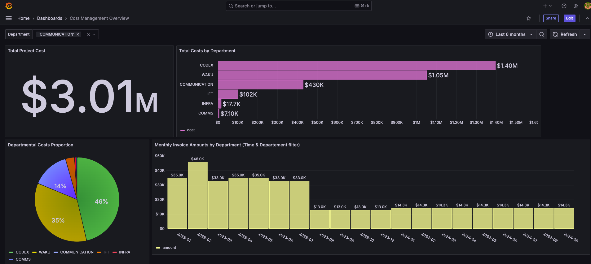

# BI Recruitment Task Solution

This repository contains my solution for the BI recruitment task for IFT.





## Changes Made

1. **Centralized Data Locally**:
   - I centralized raw and transformed data into a single local database to simplify processing and ensure consistency.
   - Initially, I attempted to use a more straightforward method ( `pg_dump`) to extract data directly, but I lacked the necessary permissions to access table metadata.
   - This led me to transfer data as CSV files and seed them into the local database using dbt.
   - Configuring dbt to work with multiple sources and targets is not a straightforward or recommended process, as dbt assumes data should already be centralized for transformations.

2. **Transformations**:
   - Focused on the `issues` and `invoice` tables.
   - Flattened JSON structures and performed necessary transformations to both tables
   - Added a currency table to convert invoice amounts to USD for consistent reporting.

3. **Dashboards**:
   - Created two Grafana dashboards (persisted under ./grafana/data/grafana.db)
     1. **Issues Dashboard**: Visualizes issue distribution and repository activity.
     2. **Cost Dashboard**: Displays project cost details.

## How to Use

**1.Clone the repository and navigate to the directory:**

    ```bash
    git clone <repo_url>
    cd <repo_directory>
    ```

**2.Grant Docker write access to  grafana.db:**

The file grafana.db is a database that I exported from my previous attempts. It already contains all the dashboards I created earlier. To ensure Docker can write to this file during runtime, you need to adjust the permissions:

```bash
 chmod 666  ./grafana/data/grafana.db
 ```

**3.  Set your environment variables:**
    Open the .env file in the root directory and fill in the required values for the external database connection.

**4.  Start the services (data transfer happens automatically):**

    ```bash
    make up
    ```

**4.  Seed the data into the database:**

    ```bash
    make dbt-seed
    ```

**5.  Run dbt models:**

    ```bash
    make dbt-run
    ```

6.  Access Grafana: http://localhost:3000 (default credentials: admin/Password!)

7.  View the dashboards in Grafana.


## Improvements

1. **Streamline Data Extraction and Loading**:
   - Implement a more elegant, automated process to extract and load data into a central data warehouse. This would streamline the workflow and ensure data is readily available for transformations.

2. **Deeper Exploration of Data**:
   - Spend additional time exploring all tables and their relationships to uncover more insights about interactions, labels, and other relevant data points. This would enable better normalization and data cleaning for higher-quality transformations.

3. **Enhance Dashboard Interactivity**:
   - Design more interactive and insightful panels to improve data visualization. For example:
     - A **stacked bar chart** could be used to compare the evolution of activity across repositories over time while also showing the percentage contribution of each repository.
     - Add more granular filters to allow project leads to focus on specific metrics or timeframes.
